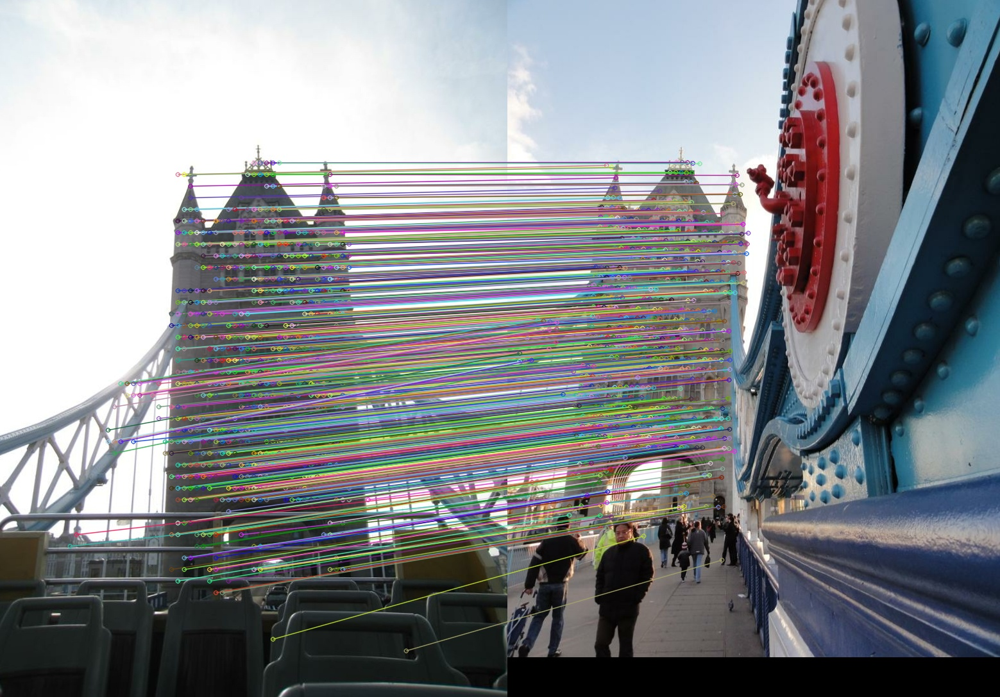

For environment and data setup, please refer to [LoFTR](https://github.com/zju3dv/LoFTR).

## Training
The results can be reproduced when training with 8 gpus. Please run the following commands.
```
sh scripts/reproduce_train/indoor_quadtree_ds.sh
```
The parameter top K can be reduced for speeding up. The performance won't drop too much. Please set this parameter in cfg.LOFTR.COARSE.TOPKS.

## Testing
```
sh scripts/reproduce_test/indoor_ds_quadtree.sh
```

## Sample to Test an Image Pair

- Download outdoor weights from this [Github Release](https://github.com/Tangshitao/QuadTreeAttention/releases/tag/QuadTreeAttention_feature_match)

- Run the following command:

```bash
python3 test_one_image_pair_sample.py --weight_path ./outdoor.ckpt \
        --config_path ./configs/loftr/outdoor/loftr_ds_quadtree.py \
        --query_path ./assets/phototourism_sample_images/london_bridge_19481797_2295892421.jpg \
        --ref_path ./assets/phototourism_sample_images/london_bridge_49190386_5209386933.jpg
```


