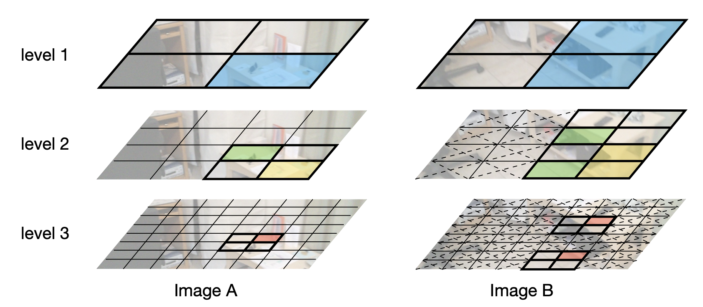

This repository contains codes for quadtree attention. This repo contains codes for feature matching, image classficiation, object detection and semantic segmentation.

<div align="center">
  
</div>


# Installation
1. Compile the quadtree attention operation
```cd QuadTreeAttention&&python setup.py install```
2. Install the package for each task according to each README.md in the separate directory. 

# Model Zoo and Baselines
We provide baselines results and model zoo in the following.

### Feature matching

- Quadtree on Feature matching

| Method           | AUC@5 | AUC@10 | AUC@20 | Model |
|------------------|:----:|:-----:|:------:|:-------:|
| Indoor     | 24.9  |  44.7 |  61.8 |[[Google]](https://drive.google.com/file/d/17c2NXPiWgn6khrNBva0bZph6ZV-Z9e-m/view?usp=sharing)/[[GitHub]](https://github.com/Tangshitao/QuadTreeAttention/releases/download/QuadTreeAttention_feature_match/indoor.ckpt) |
| Outdoor     | 53.5  |  70.2 |  82.2 |[[Google]](https://drive.google.com/file/d/1UOYdzbrXHU9kvVy9tscCCO7BB3G4rWK4/view?usp=sharing)/[[GitHub]](https://github.com/Tangshitao/QuadTreeAttention/releases/download/QuadTreeAttention_feature_match/outdoor.ckpt) |

### Image classification

- Quadtree on ImageNet-1K

| Method           | Flops | Acc@1 | Model |
|------------------|:----:|:-----:|:-----:|
| Quadtree-B-b0        |  0.6 |  72.0 |  [[Google]](https://drive.google.com/file/d/13hBEBXXmTc3NI0WOqNE89Yd5GZf7wCJN/view?usp=sharing)/[[GitHub]](https://github.com/Tangshitao/QuadTreeAttention/releases/download/QuadTreeAttention_cls/b0.pth) |
| Quadtree-B-b1        |  2.3 |  80.0 |  [[Google]](https://drive.google.com/file/d/1NB1Yu0R7QQPmo2pgQGxDbcElRx2Nc5xj/view?usp=sharing)/[[GitHub]](https://github.com/Tangshitao/QuadTreeAttention/releases/download/QuadTreeAttention_cls/b2.pth) |
| Quadtree-B-b2        |  4.5 |  82.7 |  [[Google]](https://drive.google.com/file/d/1MTexxhDpRE9idpxwswZOGsqAlt9q2L2h/view?usp=sharing)/[[GitHub]](https://github.com/Tangshitao/QuadTreeAttention/releases/download/QuadTreeAttention_cls/b2.pth) |
| Quadtree-B-b3        | 7.8  |  83.8 |  [[Google]](https://drive.google.com/file/d/1Rx_JhGDKXKfOakY8n5HQgxuAyrjBA7jA/view?usp=sharing)/[[GitHub]](https://github.com/Tangshitao/QuadTreeAttention/releases/download/QuadTreeAttention_cls/b3.pth) |
| Quadtree-B-b4        | 11.5 |  84.0 |  [[Google]](https://drive.google.com/file/d/1AiPWGJYZdqz09PZER3JpZuMJYBR___MG/view?usp=sharing)/[[GitHub]](https://github.com/Tangshitao/QuadTreeAttention/releases/download/QuadTreeAttention_cls/b4.pth) |

### Object detection and instance segmentation

- Quadtree on COCO

#### Baseline Detectors


|   Method   | Backbone | Pretrain    | Lr schd | Aug | Box AP | Mask AP | Model    |
|------------|----------|-------------|:-------:|:---:|:------:|:-------:|:-------:|
|  RetinaNet | Quadtree-B-b0 | ImageNet-1K |    1x   |  No |  38.4  |    -    | [[Google]](https://drive.google.com/file/d/1EkzDVRqz6L_2ZzVkAj-byQIB4CCr3gNp/view?usp=sharing)/[[GitHub]](https://github.com/Tangshitao/QuadTreeAttention/releases/download/QuadTreeAttention_detection/b0.pth) |
|  RetinaNet | Quadtree-B-b1 | ImageNet-1K |    1x   |  No |  42.6  |    -    | [[Google]](https://drive.google.com/file/d/1xqZoptlHj1nWEVvUBqSOiIlEiy1Y5gws/view?usp=sharing)/[[GitHub]](https://github.com/Tangshitao/QuadTreeAttention/releases/download/QuadTreeAttention_detection/b1.pth) |
|  RetinaNet | Quadtree-B-b2 | ImageNet-1K |    1x   |  No |  46.2  |    -    | [[Google]](https://drive.google.com/file/d/1n6Zyvgdf4slhKMsG4CpckGDCNbB_48oi/view?usp=sharing)/[[GitHub]](https://github.com/Tangshitao/QuadTreeAttention/releases/download/QuadTreeAttention_detection/b2.pth) |
|  RetinaNet | Quadtree-B-b3 | ImageNet-1K |    1x   |  No |  47.3  |    -    | [[Google]](https://drive.google.com/file/d/1SVIWM9JFfW9a1jIjB8gdkpOaccSgKUGc/view?usp=sharing)/[[GitHub]](https://github.com/Tangshitao/QuadTreeAttention/releases/download/QuadTreeAttention_detection/b3.pth) |
|  RetinaNet | Quadtree-B-b4 | ImageNet-1K |    1x   |  No |  47.9  |    -    | [[Google]](https://drive.google.com/file/d/1nMUhg2N59FWqbIAbZcLwSe07L1OjPHiY/view?usp=sharing)/[[GitHub]](https://github.com/Tangshitao/QuadTreeAttention/releases/download/QuadTreeAttention_detection/b4.pth) |
| Mask R-CNN | Quadtree-B-b0 | ImageNet-1K |    1x   |  No |  38.8  |   36.5  | [[Google]](https://drive.google.com/file/d/1f_NGHygQC8Y-EVLeHE5T7UjZU5n6WJJs/view?usp=sharing)/[[GitHub]](https://github.com/Tangshitao/QuadTreeAttention/releases/download/QuadTreeAttention_maskrcnn/b0_1x.pth) |
| Mask R-CNN | Quadtree-B-b1 | ImageNet-1K |    1x   |  No |  43.5  |   40.1  | [[Google]](https://drive.google.com/file/d/1916HZGGzdfHVL2osTUHOlKKH-88NkbhE/view?usp=sharing)/[[GitHub]](https://github.com/Tangshitao/QuadTreeAttention/releases/download/QuadTreeAttention_maskrcnn/b1_1x.pth) |
| Mask R-CNN | Quadtree-B-b2 | ImageNet-1K |    1x   |  No |  46.7  |   42.4  | [[Google]](https://drive.google.com/file/d/1KhKVbslAUw6tbSHDxb6vZXLGsY__gcQ_/view?usp=sharing)/[[GitHub]](https://github.com/Tangshitao/QuadTreeAttention/releases/download/QuadTreeAttention_maskrcnn/b2_1x.pth) |
| Mask R-CNN | Quadtree-B-b3 | ImageNet-1K |    1x   |  No |  48.3  |   43.3  | [[Google]](https://drive.google.com/file/d/1_STW0pE1Gt-JrLdd-G1-skheb7XTHD3y/view?usp=sharing)/[[GitHub]](https://github.com/Tangshitao/QuadTreeAttention/releases/download/QuadTreeAttention_maskrcnn/b3_1x.pth) |
| Mask R-CNN | Quadtree-B-b4 | ImageNet-1K |    1x   |  No |  48.6  |   43.6 | [[Google]](https://drive.google.com/file/d/1jebBbBhtCHw3rmHM32Kf4Z8sDlCpaGr4/view?usp=sharing)/[[GitHub]](https://github.com/Tangshitao/QuadTreeAttention/releases/download/QuadTreeAttention_maskrcnn/b4_1x.pth) |

### Semantic Segmentation

- Quadtree on ADE20K

| Method       | Backbone   | Pretrain    | Iters | mIoU | Model |
|--------------|------------|-------------|-------|------|------|
| Semantic FPN | Quadtree-b0   | ImageNet-1K | 160K   | 39.9 |[[Google]](https://drive.google.com/file/d/1qTman3_vAnEJs8g_5CeOr8wtcCK2gvJM/view?usp=sharing)/[[GitHub]](https://github.com/Tangshitao/QuadTreeAttention/releases/download/QuadTreeAttention_seg/b0.pth) |
| Semantic FPN | Quadtree-b1  | ImageNet-1K | 160K   | 44.7 |[[Google]](https://drive.google.com/file/d/1SQKe9FmpmR__Fq0bNYEvO0T_5B--zs7b/view?usp=sharing)/[[GitHub]](https://github.com/Tangshitao/QuadTreeAttention/releases/download/QuadTreeAttention_seg/b1.pth) |
| Semantic FPN | Quadtree-b2 | ImageNet-1K | 160K   | 48.7 |[[Google]](https://drive.google.com/file/d/1pyyJWvXPRxApNiCRaR4c73nVQf-yCKQ2/view?usp=sharing)/[[GitHub]](https://github.com/Tangshitao/QuadTreeAttention/releases/download/QuadTreeAttention_seg/b2.pth) |
| Semantic FPN | Quadtree-b3  | ImageNet-1K | 160K   | 50.0 | [[Google]](https://drive.google.com/file/d/1odZkr2c0Oa8jJxr3TUsgKrHaLwuMInfp/view?usp=sharing)/[[GitHub]](https://github.com/Tangshitao/QuadTreeAttention/releases/download/QuadTreeAttention_seg/b3.pth) |
| Semantic FPN | Quadtree-b4  | ImageNet-1K | 160K   | 50.6 | [[Google]](https://drive.google.com/file/d/16ZBvzR51XUk3cpnJ6D1BgIvFS9oSzzh8/view?usp=sharing)/[[GitHub]](https://github.com/Tangshitao/QuadTreeAttention/releases/download/QuadTreeAttention_seg/b4.pth) |

## Citation

```
@article{tang2022quadtree,
  title={QuadTree Attention for Vision Transformers},
  author={Tang, Shitao and Zhang, Jiahui and Zhu, Siyu and Tan, Ping},
  journal={ICLR},
  year={2022}
}
```

